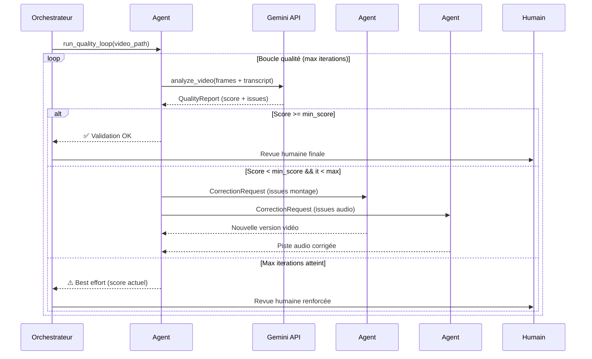

# Agent #5 — Boucle Qualité & Auto-Amélioration (Gemini)

> **Rôle** : "Cerveau qualité" du pipeline — analyse le rendu vidéo final via Gemini Vision et fournit des feedbacks actionnables aux autres agents pour une boucle d'auto-amélioration continue.

---

## Table des matières

1. [Mission & Vision](#1-mission--vision)
2. [Fonctionnement détaillé](#2-fonctionnement-détaillé)
3. [Structure du module](#3-structure-du-module)
4. [Schémas Pydantic — Feedback & Qualité](#4-schémas-pydantic)
5. [Grille d'évaluation détaillée](#5-grille-dévaluation-détaillée)
6. [Algorithme de la boucle d'itération](#6-algorithme-de-la-boucle-ditération)
7. [Interface d'intégration avec les autres agents](#7-interface-dintégration)
8. [Configuration externalisée](#8-configuration-externalisée)
9. [Logging & Débogage](#9-logging--débogage)
10. [Mode "Simple Shot" (désactivation)](#10-mode-simple-shot)
11. [Pièges connus & Antipatterns](#11-pièges-connus)
12. [Exemple de flux complet](#12-exemple-de-flux-complet)

---

## 1. Mission & Vision

### Mission

Analyser le rendu vidéo final via **Gemini Vision** (API Google, pas OpenRouter) et produire un feedback structuré permettant aux autres agents (notamment Agent #3 — Montage Hyperframes) de corriger les défauts. Le module itère jusqu'à ce qu'un seuil de qualité soit atteint.

### Vision (extrait vidéo source)

> *"Gemini est capable d'analyser le rendu de votre vidéo et de faire des feedbacks directement à Claude. Cette boucle en continu, c'est ça qui va vous permettre d'avoir un montage ultra quali."*

> *"Pensez bien à dire à Claude ou à ChatGPT que Gemini a un rôle prépondérant, parce que parfois il peut passer comme ça un peu à côté et dire 'bon, c'était son feedback, mais je continue quand même dans ma direction'. Il faut vraiment faire comprendre que Gemini a cette capacité décisionnelle sur les autres modèles."*

> *"À la fin, toujours avoir une vérification de vous, parce que ça reste de l'IA et il peut y avoir de temps à autre des moments qui sont approximativement coupés."*

### Principe clé

Gemini a un **rôle décisionnel prépondérant** sur les autres modèles du pipeline. Les feedbacks de Gemini ne sont pas de simples suggestions — ils doivent être **exécutés** par les agents cibles (sauf override humain explicite).

---

## 2. Fonctionnement détaillé

### 2.1 Séquence d'opérations

```
┌─────────────────────────────────────────────────────────────────┐
│                    AGENT #5 — QUALITY LOOP                      │
│                                                                 │
│  ┌──────────┐    ┌──────────────┐    ┌─────────────────────┐   │
│  │ Réception │───▶│ Analyse      │───▶│ Feedback Structuré  │   │
│  │ Vidéo     │    │ Gemini Vision│    │ (JSON)              │   │
│  └──────────┘    └──────────────┘    └──────────┬──────────┘   │
│                                                  │              │
│                  ┌───────────────────────────────┘              │
│                  ▼                                              │
│         ┌────────────────┐           ┌──────────────────┐       │
│         │ Score ≥ seuil  │───Oui───▶│ VALIDATION OK    │       │
│         │ ?              │           │ → sortie pipeline│       │
│         └───────┬────────┘           └──────────────────┘       │
│                 │ Non                                            │
│                 ▼                                               │
│         ┌────────────────┐                                      │
│         │ itération ≤    │───Non───▶ Timeout → release          │
│         │ max_iterations │          avec meilleur score          │
│         └───────┬────────┘                                      │
│                 │ Oui                                           │
│                 ▼                                               │
│         ┌────────────────┐                                      │
│         │ Envoyer        │────▶ Agent #3 (ou Agent cible)       │
│         │ feedback +     │      + Agent #1 si retranscription   │
│         │ demander       │      + Agent #4 si ré-audio          │
│         │ correction     │                                      │
│         └────────────────┘                                      │
│                 │                                               │
│         (retour au début avec nouvelle vidéo corrigée)          │
└─────────────────────────────────────────────────────────────────┘
```

### 2.2 Modes d'analyse

#### Mode A — Analyse vidéo complète (recommandé)
- Envoi de la vidéo finale à Gemini Vision (via API vertex ou direct)
- Gemini analyse le flux visuel + audio (pistes synchronisées)
- Extraction de frames à intervalle configurable (`analyze_every_n_frames`)
- Coût : élevé en tokens, qualité maximale

#### Mode B — Analyse par frames clés + transcript (fallback)
- Extraction de frames clés (via FFmpeg scene detection)
- Jointure avec le transcript (Agent #1) pour le contexte
- Analyse des frames + texte par Gemini Vision
- Coût : modéré, bonne qualité

#### Mode C — Analyse textuelle (fallback si pas d'accès vidéo)
- Analyse du transcript + métadonnées de montage (timestamps, transitions, B-rolls)
- Descriptif textuel du rendu attendu vs réel
- Coût : faible, qualité limitée

### 2.3 Critères d'évaluation

| Critère | Pondération | Description |
|---------|-------------|-------------|
| **Rythme** | 20% | Fluidité du montage, durée des plans adaptée au contenu |
| **Clarté** | 20% | Message compréhensible, transitions logiques entre idées |
| **Transitions** | 15% | Pertinence des transitions (cut, fondu, wipe) |
| **B-roll** | 15% | B-rolls bien placés, illustrant le propos, pas redondants |
| **Audio synchro** | 15% | Synchronisation labiale, pas de décalage audio/vidéo |
| **Coupures** | 10% | Pas de coupure brutale, pas de plan trop court |
| **Cohérence globale** | 5% | Style visuel cohérent, pas de saut de qualité |

---

## 3. Structure du module

```
agents/agent5_quality/
├── __init__.py                  # Export public : QualityAgent
├── agent.py                     # Classe principale QualityAgent
├── config.py                    # Pydantic Settings pour ce module
├── schemas.py                   # Tous les modèles Pydantic (feedback, score, etc.)
├── quality_grid.py              # Grille d'évaluation & pondérations
├── loop_engine.py               # Algorithme de boucle d'itération
├── gemini_client.py             # Client API Gemini Vision
├── frame_extractor.py           # Extraction de frames clés (fallback)
├── iteration_logger.py          # Logging structuré de chaque itération
├── integration.py               # Interface d'intégration avec les autres agents
│
├── feedback/
│   ├── __init__.py
│   ├── builder.py               # Construction du feedback structuré
│   ├── parser.py                 # Parsing de la réponse Gemini → Feedback
│   └── fixer.py                  # Corrections automatiques (mineures)
│
├── evaluation/
│   ├── __init__.py
│   ├── criteria.py               # Définition des critères d'évaluation
│   ├── scorer.py                 # Calcul du score global
│   └── thresholds.py             # Seuils de décision
│
├── learning/
│   ├── __init__.py
│   ├── memory.py                 # Mémoire des feedbacks passés
│   └── pattern_analyzer.py       # Analyse des patterns de correction
│
├── prompts/
│   ├── quality_prompt.txt        # Prompt principal pour Gemini
│   ├── analysis_prompt.txt       # Prompt d'analyse vidéo
│   └── fix_instructions.txt      # Instructions pour corrections auto
│
└── tests/
    ├── test_agent.py
    ├── test_schemas.py
    ├── test_loop_engine.py
    ├── test_quality_grid.py
    ├── test_gemini_client.py
    └── fixtures/
        └── sample_feedback.json   # Exemple de feedback pour tests
```

---

## 4. Schémas Pydantic

### 4.1 FeedbackItem — Élément de feedback individuel

```python
from pydantic import BaseModel, Field
from typing import Literal, Optional
from datetime import datetime
from enum import Enum

class Severity(str, Enum):
    LOW = "low"
    MEDIUM = "medium"
    HIGH = "high"
    CRITICAL = "critical"

class FeedbackCategory(str, Enum):
    RYTHME = "rythme"
    CLARTE = "clarte"
    TRANSITION = "transition"
    BROLL = "b_roll"
    AUDIO_SYNC = "audio_sync"
    COUPURE = "coupure"
    COHERENCE = "coherence"
    AUTRE = "autre"

class TargetAgent(str, Enum):
    AGENT1_TRANSCRIPTION = "agent1_transcription"
    AGENT2_DERUSHAGE = "agent2_derushage"
    AGENT3_MONTAGE = "agent3_montage"
    AGENT4_AUDIO = "agent4_audio"
    AGENT5_QUALITY = "agent5_quality"

class FeedbackItem(BaseModel):
    """Un élément de feedback individuel détecté par Gemini."""
    category: FeedbackCategory
    severity: Severity
    timestamp: Optional[str] = None  # "00:01:23" dans la vidéo
    description: str                  # Description du problème
    suggestion: str                   # Suggestion de correction actionnable
    target_agent: TargetAgent         # Quel agent doit corriger
    auto_fixable: bool = False        # Peut être corrigé automatiquement ?
    confidence: float = Field(default=0.8, ge=0.0, le=1.0)
```

### 4.2 QualityReport — Rapport de qualité complet

```python
class QualityReport(BaseModel):
    """Rapport complet produit par Gemini après analyse vidéo."""
    iteration: int
    timestamp: datetime = Field(default_factory=datetime.utcnow)
    video_path: str
    video_duration_seconds: float
    
    # Scores
    criteria_scores: dict[FeedbackCategory, float]  # Score par critère (0.0 - 1.0)
    overall_score: float = Field(..., ge=0.0, le=1.0)
    
    # Feedback
    issues: list[FeedbackItem]          # Problèmes détectés
    positives: list[str]                # Points positifs (renforcement)
    
    # Métadonnées
    analysis_mode: Literal["full_video", "keyframes", "textual"]
    frames_analyzed: int = 0
    gemini_model: str
    token_usage: dict[str, int] = Field(default_factory=dict)
    
    # Résultat
    passed: bool                        # True si overall_score >= min_score
    
    class Config:
        json_schema_extra = {
            "example": {
                "iteration": 1,
                "video_path": "/output/final_v1.mp4",
                "video_duration_seconds": 185.0,
                "criteria_scores": {
                    "rythme": 0.65,
                    "clarte": 0.80,
                    "transition": 0.70,
                    "b_roll": 0.55,
                    "audio_sync": 0.90,
                    "coupure": 0.75,
                    "coherence": 0.85
                },
                "overall_score": 0.72,
                "issues": [...],
                "positives": ["Le rythme général est bon"],
                "analysis_mode": "keyframes",
                "frames_analyzed": 12,
                "gemini_model": "gemini-2.5-pro",
                "token_usage": {"prompt_tokens": 4500, "completion_tokens": 1200},
                "passed": True
            }
        }
```

### 4.3 CorrectionRequest — Requête de correction vers un agent

```python
class CorrectionRequest(BaseModel):
    """Requête envoyée à un agent cible pour correction."""
    report_id: str
    iteration: int
    target_agent: TargetAgent
    priority: Literal["urgent", "high", "medium", "low"]
    items: list[FeedbackItem]
    context: dict = Field(default_factory=dict)  # Contexte supplémentaire
    gemini_instruction: str = Field(
        default="",
        description="Instruction directe de Gemini : l'agent cible DOIT exécuter ce feedback."
    )
```

### 4.4 QualityMemory — Mémoire d'apprentissage

```python
class QualityMemory(BaseModel):
    """Enregistrement d'une itération pour apprentissage futur."""
    iteration: int
    video_hash: str
    report: QualityReport
    corrections_applied: list[FeedbackItem]
    score_before: float
    score_after: Optional[float] = None
    pattern_signature: Optional[str] = None  # Hash du pattern de défauts
```

### 4.5 IterationResult — Résultat final d'une boucle

```python
class IterationResult(BaseModel):
    """Résultat complet après N itérations ou atteinte du seuil."""
    success: bool                         # True si score >= min_score
    final_iteration: int
    final_score: float
    improvement: float = Field(default=0.0)  # score_final - score_initial
    total_issues_found: int
    total_issues_fixed: int
    corrections_applied: list[CorrectionRequest]
    history: list[QualityReport]
    stopped_reason: Literal["quality_met", "max_iterations", "error", "manual_override"]
    duration_seconds: float
    token_usage_total: dict[str, int]
```

---

## 5. Grille d'évaluation détaillée

### 5.1 Critères & Sous-critères

#### Rythme (pondération : 20%)

| Sous-critère | Sous-pondération | Barème |
|-------------|:---:|--------|
| Longueur des plans adaptée au contenu | 30% | 0 = plans tous identiques, 1 = variété adaptée |
| Pas de temps mort | 25% | 0 = blancs/silences longs, 1 = flux continu |
| Accélération/ralentissement pertinents | 20% | 0 = abus de timelapse/slowmo, 1 = usage justifié |
| Pacing général du récit | 25% | 0 = monotone, 1 = crescendo/decrescendo maîtrisé |

#### Clarté (pondération : 20%)

| Sous-critère | Sous-pondération | Barème |
|-------------|:---:|--------|
| Structure narrative compréhensible | 35% | 0 = décousu, 1 = fil rouge clair |
| Transitions logiques entre idées | 30% | 0 = changements abrupts, 1 = liaisons naturelles |
| Messages clés bien mis en avant | 20% | 0 = noyé dans le flux, 1 = moments distincts |
| Pas de redondance | 15% | 0 = répétitions inutiles, 1 = concis |

#### Transitions (pondération : 15%)

| Sous-critère | Sous-pondération | Barème |
|-------------|:---:|--------|
| Choix du type de transition adapté | 40% | 0 = transitions aléatoires, 1 = justifiées |
| Durée des transitions | 30% | 0 = trop longues/courtes, 1 = calibrées |
| Cohérence stylistique | 30% | 0 = mélange chaos, 1 = palette homogène |

#### B-roll (pondération : 15%)

| Sous-critère | Sous-pondération | Barème |
|-------------|:---:|--------|
| Pertinence par rapport au propos | 40% | 0 = décoratif, 1 = illustratif |
| Placement temporel | 30% | 0 = mal synchronisé, 1 = au bon moment |
| Pas de redondance avec le visuel principal | 30% | 0 = doublon, 1 = complémentaire |

#### Audio synchro (pondération : 15%)

| Sous-critère | Sous-pondération | Barème |
|-------------|:---:|--------|
| Synchronisation labiale (si présentiel) | 35% | 0 = décalé, 1 = parfait |
| Synchronisation B-roll / VO | 25% | 0 = B-roll en décalé, 1 = synchro parfaite |
| Niveau sonore homogène | 20% | 0 = variations brutales, 1 = mix équilibré |
| Pas de bruit parasite | 20% | 0 = souffle/clics, 1 = propre |

#### Coupures (pondération : 10%)

| Sous-critère | Sous-pondération | Barème |
|-------------|:---:|--------|
| Pas de coupure en milieu de mot | 40% | 0 = coupures fréquentes, 1 = propre |
| Plans assez longs pour être lisibles | 35% | 0 = < 1s incompréhensible, 1 = > 2s |
| Pas de "jump cut" intempestif | 25% | 0 = jump cuts gênants, 1 = naturels |

#### Cohérence globale (pondération : 5%)

| Sous-critère | Sous-pondération | Barème |
|-------------|:---:|--------|
| Uniformité du style visuel | 50% | 0 = collage hétéroclite, 1 = charte homogène |
| Qualité technique stable | 50% | 0 = sauts de qualité, 1 = constant |

### 5.2 Calcul du score global

```python
def compute_overall_score(criteria_scores: dict[FeedbackCategory, float]) -> float:
    weights = {
        FeedbackCategory.RYTHME: 0.20,
        FeedbackCategory.CLARTE: 0.20,
        FeedbackCategory.TRANSITION: 0.15,
        FeedbackCategory.BROLL: 0.15,
        FeedbackCategory.AUDIO_SYNC: 0.15,
        FeedbackCategory.COUPURE: 0.10,
        FeedbackCategory.COHERENCE: 0.05,
    }
    score = sum(criteria_scores.get(cat, 0.0) * weights[cat] for cat in weights)
    return round(score, 4)
```

---

## 6. Algorithme de la boucle d'itération

### 6.1 Pseudo-code

```
FUNCTION quality_loop(video_path, config, agents) -> IterationResult:
    iteration = 0
    history = []
    best_score = 0.0
    best_report = None
    
    # == Phase 1 : Analyse initiale ==
    report = analyze_video(video_path, config)
    history.append(report)
    best_score = report.overall_score
    best_report = report
    
    log_iteration(iteration, report, "initial_analysis")
    
    # == Phase 2 : Boucle d'amélioration ==
    WHILE report.overall_score < config.min_score 
          AND iteration < config.max_iterations:
        
        iteration += 1
        
        # Vérification : convergence ?
        # Si la dernière correction n'a pas amélioré le score, on arrête
        IF len(history) >= 2:
            improvement = report.overall_score - history[-2].overall_score
            IF improvement <= 0 AND config.strict_convergence:
                log("Convergence stagnante — arrêt de la boucle")
                BREAK
        
        # Construction des requêtes de correction
        corrections = build_corrections(report, config)
        
        # Corrections automatiques pour les défauts mineurs
        IF config.auto_fix_minor:
            apply_auto_fixes(report, corrections, video_path)
        
        # Envoi des corrections aux agents cibles
        FOR correction in corrections:
            send_to_agent(correction)
        
        # Attente de la nouvelle version
        new_video_path = wait_for_new_render(video_path, timeout=config.render_timeout)
        
        # Nouvelle analyse
        new_report = analyze_video(new_video_path, config)
        new_report.iteration = iteration
        history.append(new_report)
        
        # Mise à jour du best score
        IF new_report.overall_score > best_score:
            best_score = new_report.overall_score
            best_report = new_report
        
        log_iteration(iteration, new_report, "correction_loop")
        video_path = new_video_path
        report = new_report
    
    # == Phase 3 : Résultat final ==
    success = report.overall_score >= config.min_score
    
    # Apprentissage : enregistrer les patterns
    save_to_memory(video_path, history)
    
    return IterationResult(
        success=success,
        final_iteration=iteration,
        final_score=report.overall_score,
        improvement=report.overall_score - history[0].overall_score,
        total_issues_found=sum(len(r.issues) for r in history),
        total_issues_fixed=...,  # Calculé via comparaison
        corrections_applied=...,  # Toutes les corrections envoyées
        history=history,
        stopped_reason=...,
        duration_seconds=...,
        token_usage_total=...
    )
```

### 6.2 Conditions d'arrêt (par ordre de priorité)

| Condition | Déclencheur | Action |
|-----------|-------------|--------|
| **Qualité atteinte** | `overall_score >= min_score` | ✅ Succès — sortie pipeline |
| **Max itérations** | `iteration >= max_iterations` | ⚠️ Release avec meilleur score (warning) |
| **Convergence stagnante** | `improvement <= 0` sur 2 itérations consécutives | ⏹️ Arrêt préventif (bruit) |
| **Dérive négative** | `score < initial_score * 0.8` | 🛑 Rollback à la meilleure version |
| **Timeout render** | Pas de nouvelle vidéo après timeout | 💥 Erreur — garde version précédente |
| **Override humain** | Intervention manuelle | ✋ Arrêt immédiat |

### 6.3 Seuils de qualité par criticité

| Mode | `feedback_severity` | `min_score` effectif | Comportement |
|------|:---:|:---:|------|
| **Low** | `low` | 0.55 | Validé rapidement, tolérant |
| **Medium** (défaut) | `medium` | 0.70 | Équilibre qualité/temps |
| **High** | `high` | 0.85 | Plusieurs itérations probables |
| **Critical** | `critical` | 0.95 | Analyse très poussée |

---

## 7. Interface d'intégration

### 7.1 API publique de l'Agent #5

```python
class QualityAgent:
    """
    Agent #5 — Boucle Qualité & Auto-Amélioration.
    Point d'entrée unique pour le pipeline.
    """
    
    async def run_quality_loop(
        self,
        video_path: str,
        config: QualityConfig,
        agents_registry: AgentsRegistry,   # Accès aux autres agents
    ) -> IterationResult:
        """Point d'entrée principal. Lance la boucle qualité complète."""
        ...
    
    async def analyze_single(
        self,
        video_path: str,
        analysis_mode: str = "keyframes"
    ) -> QualityReport:
        """Analyse unique (sans boucle). Utile pour debug."""
        ...
    
    async def get_quality_summary(
        self,
        video_path: str
    ) -> dict:
        """Résumé rapide : score + problèmes majeurs."""
        ...
    
    def get_iteration_history(
        self,
        session_id: str
    ) -> list[QualityReport]:
        """Récupère l'historique d'une session."""
        ...
```

### 7.2 Interface avec les autres agents

#### Correction → Agent #3 (Montage Hyperframes)

```python
class MontageCorrection:
    """Instructions de correction pour l'Agent #3."""
    cut_points: list[dict]       # "Au timestamp X, remplacer le segment Y"
    transition_changes: list[dict]  # "Transition T à remplacer par U"
    broll_adjustments: list[dict]   # "Déplacer B-roll X au timestamp Y"
    pacing_instructions: list[str]  # "Raccourcir les plans de la section intro"
```

#### Correction → Agent #1 (Transcription)

```python
class TranscriptionCorrection:
    """Instructions de correction pour l'Agent #1."""
    retranscribe_segments: list[dict]  # Segments à retranscrire
    adjust_timestamps: list[dict]      # Décalage temporel à corriger
```

#### Correction → Agent #4 (Audio)

```python
class AudioCorrection:
    """Instructions de correction pour l'Agent #4."""
    resync_segments: list[dict]  # Segments audio à resynchroniser
    volume_adjustments: list[dict]  # Ajustements de volume par piste
    noise_reduction: list[str]      # Zones avec bruit à traiter
```

### 7.3 Message de feedback — format échangé entre agents

```json
{
  "type": "quality_feedback",
  "from_agent": "agent5_quality",
  "to_agent": "agent3_montage",
  "priority": "high",
  "gemini_override": true,
  "timestamp": "2026-07-08T14:30:00Z",
  "body": {
    "issues": [
      {
        "category": "b_roll",
        "severity": "high",
        "timestamp": "00:02:15",
        "description": "Le B-roll sur la section 'architecture système' apparaît 2 secondes trop tard, après le début de l'explication.",
        "suggestion": "Décaler le B-roll 'arch_diagram.mp4' de -2s pour qu'il commence exactement au moment où le locuteur dit 'l'architecture'.",
        "target_agent": "agent3_montage",
        "auto_fixable": true
      },
      {
        "category": "audio_sync",
        "severity": "critical",
        "timestamp": "00:05:47",
        "description": "Décalage audio de ~300ms entre la piste voix et la vidéo au début du segment 5.",
        "suggestion": "Recalibrer le segment audio 5 avec un offset de -300ms.",
        "target_agent": "agent4_audio",
        "auto_fixable": false
      }
    ],
    "overall_score": 0.68,
    "iteration": 2
  }
}
```

### 7.4 Pipeline orchestrator — intégration

```yaml
# Dans le pipeline principal (orchestrator)
pipeline:
  agents:
    - agent1_transcription
    - agent2_derushage
    - agent3_montage
    - agent4_audio
    - agent5_quality       # ← Boucle qualité
    - agent6_human_review  # ← Vérification humaine finale

  quality_loop:
    enabled: true
    max_iterations: 3
    min_score: 0.7
    agents_in_loop:
      - agent3_montage      # Agent principal de correction
      - agent4_audio        # Correction audio si besoin
      - agent1_transcription # Retranscription si besoin
    human_override: true    # Possible d'arrêter la boucle manuellement
```

---

## 8. Configuration externalisée

Fichier : `config/quality.yaml`

```yaml
quality:
  # === Seuils de validation ===
  min_score: 0.7                    # Score minimum pour validation
  max_iterations: 3                 # Max de boucles de correction (HARD CAP)
  feedback_severity: "medium"       # low | medium | high | critical
  
  # === Analyse vidéo ===
  analyze_every_n_frames: 30        # Intervalle d'extraction de frames
  max_frames_per_analysis: 100      # Hard cap du nombre de frames analysées
  analysis_mode: "keyframes"        # full_video | keyframes | textual
  video_max_duration_minutes: 30    # Durée max pour analyse full_video
  
  # === Corrections ===
  auto_fix_minor: true              # Corriger automatiquement les défauts mineurs ?
  auto_fix_categories:              # Catégories éligibles à l'auto-fix
    - "b_roll"
    - "coupure"
    - "transition"
  
  # === Modèle Gemini ===
  gemini_model: "gemini-2.5-pro"
  gemini_temperature: 0.3           # Température basse = feedback cohérent
  gemini_max_tokens: 8192           # Max tokens pour la réponse
  gemini_api_timeout: 60            # Timeout appel API (secondes)
  
  # === Boucle ===
  strict_convergence: true          # Arrêter si score n'augmente plus ?
  render_timeout: 300               # Timeout attente nouveau render (secondes)
  rollback_on_regression: true      # Revenir à la meilleure version si dégradation ?
  
  # === Logging & Mémoire ===
  log_each_iteration: true
  save_frames_analyzed: false       # Sauvegarder les frames analysées (debug)
  keep_iteration_artifacts: true    # Garder les vidéos intermédiaires ?
  memory_size: 100                  # Nombre de sessions conservées en mémoire
  
  # === Mode désactivé ===
  enabled: true                     # false = "simple shot" sans feedback loop
```

---

## 9. Logging & Débogage

### 9.1 Structure des logs

Chaque itération produit un fichier de log structuré :

```
logs/quality_loop/
└── session_{session_id}/
    ├── iteration_0_initial.json        # Rapport initial
    ├── iteration_0_frames/             # Frames analysées (si save activé)
    │   ├── frame_0000.jpg
    │   ├── frame_0030.jpg
    │   └── ...
    ├── iteration_1_corrections.json    # Corrections envoyées
    ├── iteration_1_report.json         # Rapport après correction
    ├── iteration_1_comparison.json     # Delta scores
    ├── ...
    ├── final_report.json               # Rapport final
    ├── loop_summary.json               # Résumé de la boucle
    └── gemini_api_calls.log           # Log des appels API Gemini
```

### 9.2 Exemple de log d'itération

```json
{
  "iteration": 1,
  "timestamp": "2026-07-08T14:30:00Z",
  "duration_ms": 12345,
  "video_path": "/output/final_v2.mp4",
  "analysis": {
    "mode": "keyframes",
    "frames_analyzed": 8,
    "tokens_used": { "prompt": 4500, "completion": 1200 },
    "cost_estimate_usd": 0.085
  },
  "scores": {
    "before": 0.65,
    "after": 0.78,
    "delta": "+0.13",
    "criteria": {
      "rythme": { "before": 0.60, "after": 0.75, "delta": "+0.15" },
      "b_roll": { "before": 0.50, "after": 0.72, "delta": "+0.22" }
    }
  },
  "issues": {
    "found": 4,
    "fixed": 2,
    "remaining": 2,
    "auto_fixed": 1
  },
  "decision": "continue",
  "next_action": "send_corrections_to_agent3"
}
```

### 9.3 Métriques de monitoring

```python
class QualityMetrics(BaseModel):
    """Métriques exposées pour monitoring du pipeline."""
    session_id: str
    iterations_count: int
    total_duration_seconds: float
    final_score: float
    score_improvement: float
    total_tokens: int
    total_cost_usd: float
    gemsini_calls: int
    auto_fixes_applied: int
    human_interventions: int
    stopped_reason: str
```

---

## 10. Mode "Simple Shot" (désactivation)

### 10.1 Activation

```yaml
# Dans config/quality.yaml
quality:
  enabled: false   # Désactive complètement la boucle qualité
```

### 10.2 Comportement

Quand `enabled: false` :

1. **Aucun appel à Gemini** n'est effectué
2. La vidéo passe directement de l'Agent #4 (Audio) à la validation humaine (Agent #6)
3. Le pipeline ignore complètement l'Agent #5
4. Aucun coût API Gemini
5. Aucune itération de correction automatique

### 10.3 Utilisation recommandée

- **Brouillons / versions de travail** : économie de tokens, itération rapide
- **Vidéos très courtes** (< 30s) : la qualité humaine suffit
- **Problèmes API Gemini** : fallback pour ne pas bloquer le pipeline
- **Tests** : mode de test sans dépendance externe

---

## 11. Pièges connus

### 11.1 Gemini peut être trop "gentil" ou trop critique

**Problème** : Selon le prompt et la température, Gemini peut :
- Surévaluer la qualité (score > 0.9 systématiquement) → boucle ne s'enclenche jamais
- Être trop critique (score < 0.4) → boucle infinie ou découragement

**Solution** :
- Température à 0.3 pour des feedbacks cohérents et reproductibles
- Calibration périodique : analyser une vidéo de référence connue et ajuster le prompt
- Dans le prompt : "Soyez précis et constructif. Évaluez chaque critère indépendamment."
- Validation croisée : si `overall_score` est anormalement haut (> 0.95) ou bas (< 0.3) à la première itération, lancer une seconde analyse pour confirmer

### 11.2 Coût élevé en tokens

**Problème** : L'analyse vidéo Gemini coûte cher :
- Chaque frame analysée = tokens image
- Une vidéo de 10 min à 30 fps = 18 000 frames potentielles
- À `analyze_every_n_frames: 30` = 600 frames par analyse
- Multiplié par `max_iterations` itérations

**Solution** :
- `max_frames_per_analysis: 100` (hard cap sécurité)
- `analysis_mode: "keyframes"` plutôt que `"full_video"` par défaut
- Détection de scenes FFmpeg pour n'analyser que les frames de transition
- Cache : ne pas ré-analyser les segments identiques entre itérations
- Budget tokens configurable : `max_tokens_per_session: 50000`

### 11.3 Boucle infinie

**Problème** : Si les critères sont trop stricts ou que le feedback est trop pointilleux, la boucle peut ne jamais converger.

**Solution** :
- `max_iterations: 3` (HARD CAP, non modifiable au runtime sans override)
- `strict_convergence: true` (arrêt si le score n'augmente pas)
- `rollback_on_regression: true` (revenir à la meilleure version si dégradation)
- Seuil de tolérance : si le score est à 0.68 et le seuil à 0.70, on valide quand même après 3 itérations (tolérance 0.02)
- Détection d'oscillation : si les feedbacks se contredisent entre itérations (ex: it1 "rajouter du B-roll", it2 "enlever du B-roll"), arrêt avec un warning

### 11.4 Feedback contradictoire (convergence instable)

**Problème** : Entre deux itérations, Gemini peut donner des feedbacks contradictoires :
- Itération 1 : "Le rythme est trop lent, accélérer les plans"
- Itération 2 : "Le rythme est trop rapide, ralentir les plans"

**Solution** :
- **Mémoire de feedback** : chaque feedback inclut l'historique des feedbacks passés
- Prompt à Gemini : "Voici les feedbacks des itérations précédentes. Assurez-vous que vos nouveaux feedbacks sont cohérents avec l'évolution."
- Détection de contradiction : comparer les vecteurs de feedback entre itérations
- Si contradiction détectée → alerte + arrêt de la boucle avec la meilleure version
- Pattern "thermostat" : ne pas appliquer un feedback qui annule le feedback de l'itération précédente

### 11.5 La qualité perçue est subjective

**Problème** : Les critères "rythme", "clarté", "pertinence" sont subjectifs. Deux analyses du même rendu peuvent diverger.

**Solution** :
- Définir des critères très précis avec une grille de notation explicite (voir section 5)
- Utiliser le même prompt systématiquement (pas de variation)
- Température 0 pour la reproductibilité
- 3 analyses consensus : lancer 3 analyses parallèles et prendre la moyenne (coûteux)

### 11.6 Attention à ne pas rendre Gemini "optionnel"

**Piège spécifique de l'orchestration** :
> "Pensez bien à dire à Claude ou à ChatGPT que Gemini a un rôle prépondérant, parce que parfois il peut passer comme ça un peu à côté et dire 'bon, c'était son feedback, mais je continue quand même dans ma direction'."

**Solution** :
- Le message de feedback inclut `"gemini_override": true` : signal fort que le feedback DOIT être exécuté
- Dans le prompt de l'Agent #3 : "Les feedbacks de l'Agent #5 (Gemini) sont prioritaires. Ne les ignorez pas."
- L'orchestrateur vérifie que les corrections ont bien été appliquées avant de lancer une nouvelle analyse

---

## 12. Exemple de flux complet

### Scénario : Vidéo tutoriel technique (8 min)

```
ITÉRATION 0 — Analyse initiale
  Score : 0.62 (sous le seuil 0.70)
  Problèmes détectés :
    [HIGH]   B-roll placé 2s trop tard (00:02:15)
    [MEDIUM] Transition cut trop brutale (00:04:30)
    [LOW]    Volume micro légèrement bas (00:01:00 - 00:03:00)
    [HIGH]   Plan trop court (1.2s) sur segment démo (00:05:47)
  Actions : corrections envoyées aux Agents #3 et #4

ITÉRATION 1 — Après corrections
  Score : 0.78 ✓ (seuil atteint)
  Amélioration : +0.16
  Problèmes résolus : 3/4
  Problème restant : [LOW] Volume micro (auto-fix appliqué)
  Décision : ✅ VALIDÉ

Durée totale boucle : 4 min 32 sec
Coût API Gemini : ~$0.17 (2 analyses × 8 frames)
Vidéo finale : /output/final_v2.mp4
```

### Scénario : Boucle non convergente (max iterations)

```
ITÉRATION 0 — Score : 0.55
ITÉRATION 1 — Score : 0.63 (+0.08)
ITÉRATION 2 — Score : 0.65 (+0.02, convergence lente)
ITÉRATION 3 — Score : 0.67 (+0.02, max iterations atteint)
  Décision : ⚠️ RELEASE avec meilleur score (0.67)
  Warning : score sous le seuil de 0.70
  Recommandation : revue humaine renforcée
```

---

## Annexe A : Prompt Gemini (version courte)

```
Tu es un expert en qualité de montage vidéo. Analyse la vidéo ci-dessous et
évalue-la selon ces critères : rythme, clarté, transitions, B-roll, audio synchro,
coupures, cohérence globale.

Pour chaque critère, donne un score de 0.0 à 1.0.
Pour chaque problème détecté, fournis :
  - La catégorie
  - La sévérité (low/medium/high/critical)
  - Le timestamp précis
  - Une description claire
  - Une suggestion de correction actionnable
  - L'agent cible de la correction

Sois précis et constructif. Évalue chaque critère indépendamment.
Température : 0.3 — sois cohérent et reproductible.

Format de réponse (JSON uniquement) :
{
  "criteria_scores": { "rythme": 0.0-1.0, ... },
  "overall_score": 0.0-1.0,
  "issues": [ { "category": "...", "severity": "...", "timestamp": "...", ... } ],
  "positives": [...]
}
```

---

## Annexe B : Dépendances

```txt
# requirements.txt — Agent #5
google-generativeai>=0.8.0       # API Gemini officielle Google
opencv-python>=4.9.0             # Extraction de frames
ffmpeg-python>=0.2.0             # Scene detection, extraction
pydantic>=2.0.0                  # Schémas de données
pyyaml>=6.0                      # Configuration
httpx>=0.27.0                    # Client HTTP pour Gemini (fallback)
structlog>=24.0.0                # Logging structuré
```

---

## Annexe C : Diagramme de séquence (Mermaid)



---

*Document créé le 2026-07-08 — Spécification v1.0 — Agent #5 Boucle Qualité & Auto-Amélioration*
